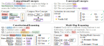

# ActivationReasoning: Logical Reasoning in Latent Activation Spaces

**ActivationReasoning (AR)** is a framework that embeds **logical reasoning directly into the latent activation space of large language models (LLMs)**.
It transforms continuous activations into logical propositions and applies explicit reasoning rules over them, enabling transparent, interpretable, and controllable model behavior.

 AR  proceeds in three stages: 
1. **Finding latent representations**, first latent concept representations are identified (e.g., via SAEs) and organized into a dictionary; 
2. **Activating propositions**, at inference time AR detects activating concepts and maps them to logical propositions; and 
3. **Logical reasoning**, applying logical rules over these propositions to infer higher-order structures, compose new concepts, and steer model behavior. 


## 🧩 Key Features

* **Logic in Latent Space:** Apply symbolic rules over latent activations.
* **Interpretability:** Trace decisions back to individual features.
* **Compositional Reasoning:** Derive higher-level abstractions from base concepts.
* **Control:** Steer model activations directly for alignment and safety.


## 🔧 Installation
AR is compatible with:

* [**SAELens**](https://github.com/decoderesearch/SAELens) (for Gemma-Scope)
* [**EleutherAI Sparsify**](https://github.com/EleutherAI/sparsify) (for SAE-Llama)

Please install the corresponding repository before running AR. 
For Sparsify install the corresponing repository. For SAELens you may use python 3.11 and install dependencies via:

```bash
pip install -r requirements.txt
```

## 🚀 Deploying AR
The `golden_gate.ipynb` notebook (our Golden Gate Bridge walkthrough) shows the full flow end to end. The quick-start below mirrors that flow:
- Pick a backbone + SAE pair (`llama3_1`, `gemma2` examples) and point AR to the layer/hook where activations should be read.
- Define your symbolic ingredients (`rules`, `concepts`) and a cache directory to store discovered activations and reasoning artifacts.
- Instantiate `ActivationReasoning` with a `LogicConfig`; defaults favor top-k concept search/steering. See `ar/config.py` for every knob (search, detection, steering, reasoning) and use `LogicConfig.load/save` to version configs.
- Run `search()` once to index concept latent representations (uses config search/detection knobs, caches to `output/`).
- Call `detect()` to scan prompts and return detected concepts/metadata without generation.
- Use `generate()` to steer generation with active rules; pass `logic_config` to override on the fly and `return_meta_data=True` to inspect concept/rule activations.

```python
from activation_reasoning import ActivationReasoning
from activation_reasoning.logic.config import LogicConfig

llama3_1 = {
    "model_name": "meta-llama/Meta-Llama-3.1-8B",
    "sae_name": "EleutherAI/sae-llama-3.1-8b-64x",
    "layer": 23,
    "hookpoint": "layers.23",
}

gemma2 = {
    "model_name": "google/gemma-2-9b-it",
    "sae_name": "gemma-scope-9b-pt-res-canonical",
    "layer": 20,
    "hookpoint": "layer_20/width_131k/canonical",
}

al_model = ActivationReasoning(
    rules=rules,
    concepts=concepts,
    cache_dir=f"output",
    **gemma2,
    config=LogicConfig(),
    verbose=True,
    )

```

## 🧩 Example Use Cases




## 📈 Results Summary

| Task                  | Model        | w/ AR     | Gain   |
| --------------------- | ------------ | --------- | ------ |
| PrOntoQA (5-hop)      | Llama-3.1-8B | **95.3%** | +45.0% |
| Rail2Country-Meta     | Gemma-2-9B   | **86.0%** | +60.3% |
| ProverQA (Hard)       | Llama-3.1-8B | **70.8%** | +34.0% |
| BeaverTails (Overall) | Llama-3.1-8B | **83.0%** | +25.2% |

AR outperforms standard SAEs, instruction-tuned models, and even reasoning-specialized LLMs such as **DeepSeek-R1** and **GPT-4o**.


## 🔍 Citation

If you use this code or datasets, please cite:

```bibtex
@inproceedings{helff2025activationreasoning,
  title={ActivationReasoning: Logical Reasoning in Latent Activation Spaces},
  author={Lukas Helff and Ruben Härle and Wolfgang Stammer and Felix Friedrich and Manuel Brack and Antonia Wüst and Hikaru Shindo and Patrick Schramowski and Kristian Kersting},
  booktitle={NeurIPS 2025 Workshop on Foundations of Reasoning in Language Models},
  year={2025},
  url={https://openreview.net/forum?id=C25SgeXWjE}
}
```

---

## 🧩 Acknowledgements

Supported by **hessian.AI**, **DFKI**, **CERTAIN**, **Aleph Alpha Lab 1141**, and **TU Darmstadt**.
This research was partly funded by **BMBF (01IS22091)** and **DFG EXC-3057 “Reasonable AI.”**
